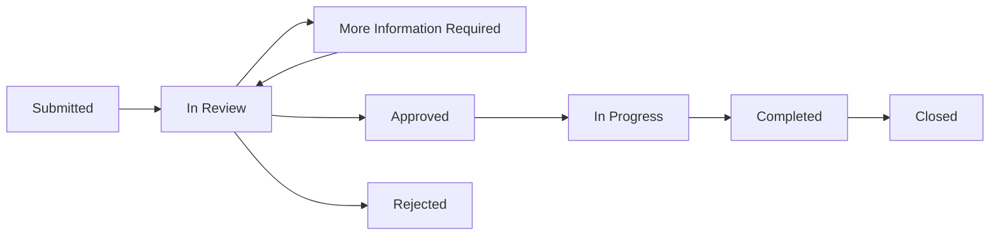
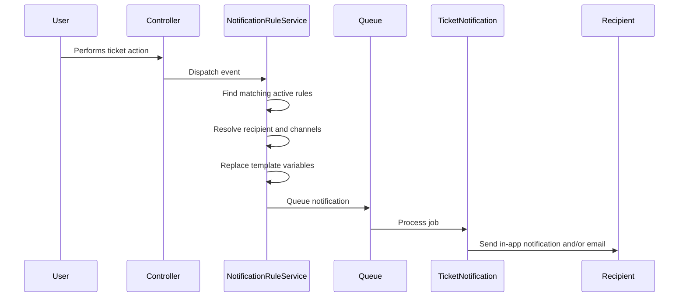
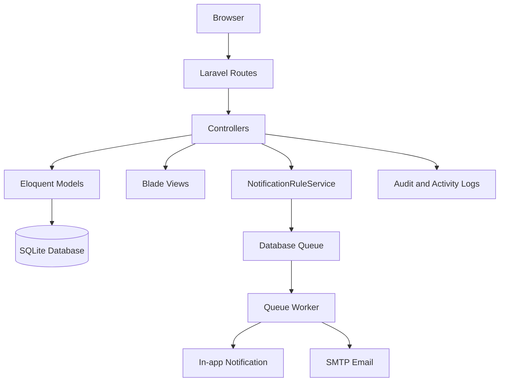
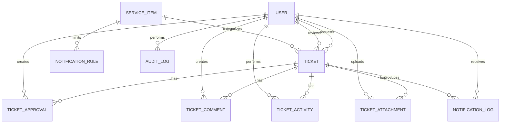
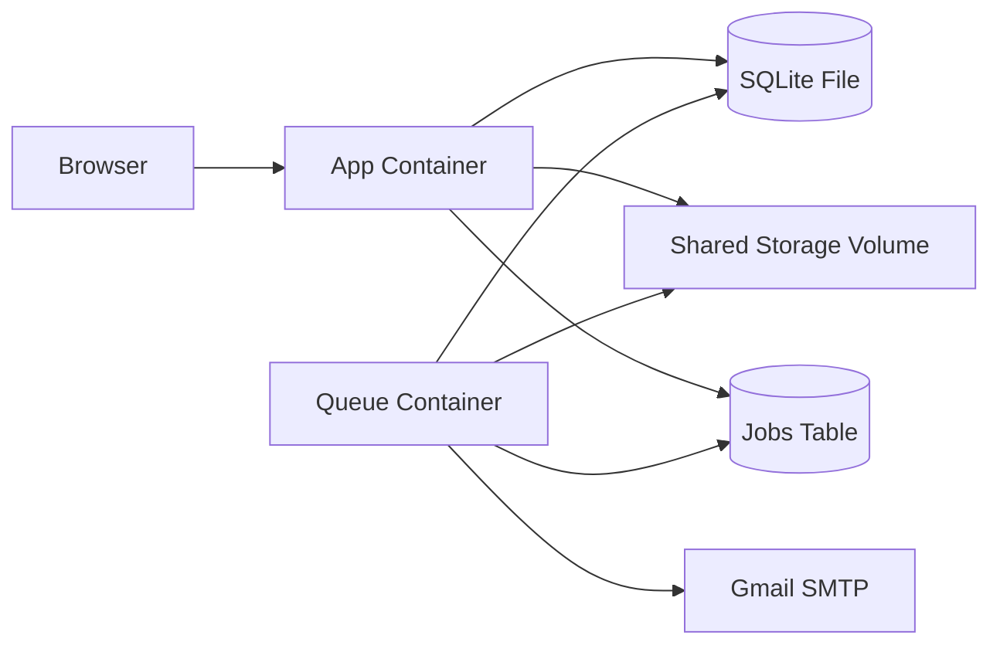

# RequestHub

Automated Request Processing and Notification System built with Laravel.

RequestHub is a service request and ticket management application where notifications are not sent manually. They are triggered by events in the system, such as:

- a new ticket being created;
- a ticket being approved or rejected;
- more information being requested;
- a public comment being added;
- a ticket status being changed.

Administrators define notification rules, recipients, channels, subjects, and message templates. Notifications are processed through Laravel queues and delivered as in-app notifications and email messages.

---

## Quick Start with Docker

### Prerequisites

Install:

- Git
- Docker
- Docker Compose

### 1. Clone the repository

```bash
git clone https://github.com/SretenGlavinceski/Automated-Request-System.git
cd Automated-Request-System
```

### 2. Create the Docker environment file

```bash
cp .env.docker.example .env.docker
```

Generate an application key:

```bash
docker run --rm php:8.4-cli php -r "echo 'base64:'.base64_encode(random_bytes(32)).PHP_EOL;"
```

Copy the generated value into `.env.docker`:

```env
APP_KEY=base64:generated_key_here
```

### 3. Create the SQLite database file

```bash
touch database/database.sqlite
```

### 4. Configure email

Email is optional for the first startup. To send real email through Gmail SMTP, add these values to `.env.docker`:

```env
MAIL_MAILER=smtp
MAIL_HOST=smtp.gmail.com
MAIL_PORT=587
MAIL_USERNAME=your-email@gmail.com
MAIL_PASSWORD=your-google-app-password
MAIL_ENCRYPTION=tls
MAIL_FROM_ADDRESS=your-email@gmail.com
MAIL_FROM_NAME=RequestHub
```

Use a Google App Password, not the normal Gmail account password.

### 5. Build and start the application

```bash
docker compose up -d --build
```

Open:

```text
http://localhost:8000
```

The Docker setup starts:

- the Laravel web application;
- the Laravel queue worker;
- SQLite through a bind-mounted database file;
- persistent Laravel storage through a Docker volume.

### 6. Create demo data

```bash
docker compose exec app php artisan migrate:fresh --seed
```

This command deletes all existing application data before running the migrations and seeders.

### Useful Docker commands

```bash
docker compose ps
docker compose logs -f app
docker compose logs -f queue
docker compose down
docker compose up -d
docker compose up -d --build
docker compose exec app php artisan migrate:status
docker compose exec app php artisan queue:failed
docker compose exec app php artisan tinker
```

---

## Project Purpose

The main requirement was to build a Laravel application where notifications are generated automatically from system events.

The initial idea included events such as:

- new ticket;
- contract expiration;
- approved leave request;
- new reservation.

The current implementation focuses on service requests and tickets. The same notification mechanism can later be reused for contracts, reservations, leave requests, and other business processes.

The project demonstrates:

- event-based notification triggering;
- configurable if/then notification rules;
- multiple delivery channels;
- reusable message templates;
- queued background processing;
- notification delivery logging;
- system activity auditing;
- role-based request processing;
- dashboard monitoring.

---

## Main Functionalities

### Authentication

Users can:

- register;
- log in;
- log out;
- access pages based on their role.

Passwords are hashed by Laravel.

### User Roles

The system contains three roles.

#### Regular user

A regular user can:

- create service requests;
- view their own tickets;
- assign a reviewer during ticket creation;
- add public comments;
- upload attachments;
- see ticket history;
- receive in-app and email notifications.

#### Reviewer

A reviewer can:

- view tickets assigned to them;
- approve a ticket;
- reject a ticket;
- request more information;
- add public comments;
- add internal notes;
- update ticket status;
- upload and download attachments.

#### Administrator

An administrator can:

- view all tickets;
- review any ticket;
- manage users and roles;
- manage service items;
- configure notification rules;
- view audit logs;
- view notification delivery logs;
- monitor system activity from the dashboard.

---

## Service Items

Service items represent request categories.

Examples:

- Vacation Request
- Infrastructure Access
- Software Request
- Equipment Request

Administrators can:

- create service items;
- edit service items;
- activate or deactivate them;
- delete them.

Only active service items are shown when a user creates a ticket.

---

## Ticket Workflow

A ticket contains:

- ticket number;
- requester;
- reviewer;
- service item;
- title;
- description;
- priority;
- status;
- timestamps.

Ticket numbers are generated in a readable format:

```text
REQ-000001
REQ-000002
```

Supported statuses:

```text
submitted
in_review
more_information_required
approved
rejected
in_progress
completed
closed
```

Typical workflow:



Reviewers can approve, reject, or request more information.

A rejection and a request for more information require a comment.

Final decisions are protected from accidental repeated review actions.

---

## Comments and Internal Notes

Tickets support two types of communication.

### Public comments

Public comments are visible to:

- the requester;
- the assigned reviewer;
- administrators.

They can trigger notification rules.

### Internal notes

Internal notes are visible only to:

- reviewers;
- administrators.

They are not shown to regular users and do not notify the requester.

---

## Attachments

Users with ticket access can upload attachments.

Supported types include:

- PDF;
- DOC;
- DOCX;
- JPG;
- JPEG;
- PNG;
- TXT.

The maximum file size is 5 MB.

Attachment access is checked on the server. A user cannot download an attachment from a ticket they are not allowed to view.

Uploaded files are recorded in:

- the attachment list;
- the ticket timeline;
- the audit log.

---

## Ticket Timeline

Each ticket has a timeline that records important activity.

Examples:

- ticket created;
- comment added;
- internal note added;
- attachment uploaded;
- review decision saved;
- status changed.

Each activity contains:

- actor;
- description;
- timestamp;
- optional metadata.

Internal timeline entries are hidden from regular users.

---

## Notification Requirements

The notification system is the central part of the project.

Notifications are not written directly into every controller with fixed messages. Instead, administrators configure rules that define what should happen when an event occurs.

A rule contains:

- service item condition;
- event;
- recipient type;
- in-app channel;
- email channel;
- email subject;
- message template;
- active status.

This provides configurable if/then behavior:

```text
IF event = ticket_approved
AND service item = Vacation Request
THEN notify requester
USING in-app and email
```

---

## Supported Notification Events

Current events:

```text
ticket_created
ticket_approved
ticket_rejected
more_information_required
comment_added
```

Example behavior:

| Event | Typical recipient | Purpose |
|---|---|---|
| `ticket_created` | Reviewer | A new ticket was assigned |
| `ticket_approved` | Requester | The request was approved |
| `ticket_rejected` | Requester | The request was rejected |
| `more_information_required` | Requester | The reviewer needs more details |
| `comment_added` | Reviewer or requester | A new public comment was added |

The architecture can be extended with more events, such as:

```text
ticket_status_changed
attachment_added
contract_expiring
reservation_created
leave_approved
```

---

## Notification Channels

A rule can enable one or both channels.

### In-app notifications

In-app notifications are stored in Laravel's notifications table.

Users can:

- see unread notifications;
- open the related ticket;
- mark notifications as read.

### Email notifications

Email notifications are sent through Laravel Mail.

The project supports SMTP configuration. Gmail SMTP is used for the current setup.

Email notifications are queued and sent by the queue worker.

---

## Message Templates

Administrators can create reusable subjects and messages.

Supported variables:

```text
{{ ticket.number }}
{{ ticket.title }}
{{ ticket.status }}
{{ requester.name }}
{{ reviewer.name }}
{{ recipient.name }}
{{ service_item.name }}
```

Example subject:

```text
Ticket {{ ticket.number }} was approved
```

Example message:

```text
Hello {{ recipient.name }}, your request "{{ ticket.title }}" was approved.
```

Before the notification is sent, the application replaces each placeholder with real ticket data.

Example output:

```text
Hello Sreten, your request "Infrastructure Access" was approved.
```

---

## How Notification Processing Works



Controllers dispatch business events after a successful action.

Examples:

```php
$notificationRuleService->dispatch($ticket, 'ticket_created');
```

```php
$notificationRuleService->dispatch($ticket, 'ticket_approved');
```

The service:

1. finds active matching rules;
2. checks the service item condition;
3. resolves the requester or reviewer;
4. builds the list of channels;
5. replaces message variables;
6. creates a queued notification.

---

## Laravel Queues

Notifications implement queued processing.

The queue worker runs separately from the web application:

```bash
php artisan queue:work
```

In Docker, this is handled by the `queue` service.

Benefits:

- ticket requests return faster;
- email sending does not block the browser;
- failed jobs can be inspected;
- jobs can be retried;
- processing attempts are recorded.

Useful commands:

```bash
docker compose exec app php artisan queue:failed
docker compose exec app php artisan queue:retry all
docker compose restart queue
```

---

## Notification Delivery Logs

The project contains a separate notification log.

Each delivery record can contain:

- ticket;
- recipient;
- channel;
- message;
- status;
- number of attempts;
- error message;
- sent timestamp;
- failed timestamp;
- tracking identifier.

Typical statuses:

```text
processing
sent
failed
```

Database and email delivery are stored as separate channel records.

This allows administrators to see whether a notification succeeded or failed.

---

## Audit Logs

Audit logs record important application changes.

Examples:

- ticket created;
- ticket reviewed;
- comment added;
- internal note added;
- attachment uploaded;
- status changed;
- user created;
- user role changed.

An audit record contains:

- user who performed the action;
- action name;
- entity type;
- entity ID;
- description;
- previous values;
- new values;
- timestamp.

Audit logs are visible only to administrators.

The audit log answers questions such as:

- who changed the status;
- when a ticket was approved;
- who added an internal note;
- which role a user had before an update.

---

## Dashboard

The dashboard shows role-specific information.

### Regular user dashboard

- number of own tickets;
- number of open tickets;
- unread notifications;
- quick links for ticket creation and ticket list.

### Reviewer dashboard

- tickets assigned for review;
- pending review count;
- personal tickets;
- unread notifications.

### Administrator dashboard

- all ticket count;
- failed notification count;
- recent audit activity;
- links to administration pages.

The interface uses Bootstrap and a ServiceNow-inspired layout with:

- sidebar navigation;
- top navigation;
- summary cards;
- responsive tables;
- ticket status badges;
- role-specific menu items.

---

## Application Architecture

The project follows Laravel's MVC structure.



Main parts:

- **Routes** define application endpoints.
- **Controllers** validate requests and coordinate actions.
- **Models** represent database entities.
- **Blade views** render the interface.
- **NotificationRuleService** applies notification rules.
- **TicketNotification** formats in-app and email messages.
- **Queue worker** processes notifications in the background.
- **Audit logs** record system changes.
- **Ticket activities** build the visible timeline.

---

## Project Structure

```text
app/
├── Http/
│   └── Controllers/
├── Models/
├── Notifications/
├── Providers/
└── Services/

bootstrap/
config/
database/
├── factories/
├── migrations/
└── seeders/

docker/
└── entrypoint.sh

public/
resources/
├── css/
├── js/
└── views/
    ├── auth/
    ├── layouts/
    ├── partials/
    ├── tickets/
    ├── users/
    ├── service-items/
    ├── notification-rules/
    ├── audit-logs/
    └── notification-logs/

routes/
storage/
tests/

Dockerfile
docker-compose.yml
.env.docker.example
```

### Controllers

Controllers handle operations such as:

- authentication;
- dashboard data;
- ticket creation and viewing;
- approvals;
- comments;
- attachments;
- ticket status updates;
- user administration;
- service-item administration;
- notification-rule administration;
- audit-log viewing;
- notification-log viewing.

### Models

Main models:

```text
User
ServiceItem
Ticket
TicketApproval
TicketComment
TicketActivity
TicketAttachment
NotificationRule
NotificationLog
AuditLog
```

### Views

Blade views are organized by feature.

Shared layouts provide:

- top navigation;
- sidebar;
- flash messages;
- page structure;
- Bootstrap and Vite assets.

---

## Database Design

Main relationships:



### Important tables

| Table | Purpose |
|---|---|
| `users` | Accounts and roles |
| `service_items` | Request categories |
| `tickets` | Main service requests |
| `ticket_approvals` | Review decisions |
| `ticket_comments` | Public comments and internal notes |
| `ticket_activities` | Ticket timeline |
| `ticket_attachments` | Uploaded file metadata |
| `notification_rules` | Configurable notification behavior |
| `notifications` | Laravel in-app notifications |
| `notification_logs` | Delivery monitoring |
| `audit_logs` | General system audit history |
| `jobs` | Queued background jobs |
| `failed_jobs` | Failed queue jobs |

---

## Docker Architecture

The project uses two containers.



### App service

The `app` service:

- runs Laravel;
- applies migrations on startup;
- serves the application on port 8000;
- reads and writes the SQLite database;
- stores sessions, cache, logs, and uploaded files.

### Queue service

The `queue` service:

- runs `php artisan queue:work`;
- processes queued notifications;
- sends email;
- writes delivery statuses.

### Multi-stage image

The Dockerfile uses separate stages:

1. Composer installs PHP dependencies.
2. Node builds Vite assets.
3. PHP 8.4 runs the application.

This keeps the final image smaller and avoids running Node or Composer in production.

---

## Local Setup Without Docker

Requirements:

- PHP 8.4 or newer;
- Composer;
- Node.js;
- npm;
- SQLite.

Install dependencies:

```bash
composer install
npm install
```

Create the environment:

```bash
cp .env.example .env
php artisan key:generate
touch database/database.sqlite
```

Run migrations:

```bash
php artisan migrate --seed
```

Build frontend assets:

```bash
npm run build
```

Start the application:

```bash
php artisan serve
```

Start the queue worker in another terminal:

```bash
php artisan queue:work
```

---

## Security

Implemented protections include:

- CSRF protection on forms;
- Laravel password hashing;
- authentication middleware;
- role checks;
- ticket ownership and reviewer checks;
- admin-only administration pages;
- server-side attachment authorization;
- internal-note visibility rules;
- file type and size validation;
- hidden environment files;
- queued email credentials stored outside the repository.

Do not commit:

```text
.env
.env.docker
database/database.sqlite
Gmail App Passwords
real application keys
```

The current Docker setup is intended for development, demonstration, and university presentation.

A production deployment should use:

- PostgreSQL or MySQL;
- Nginx or another production web server;
- HTTPS;
- a production mail provider;
- secret management;
- backups;
- automated tests;
- rate limiting;
- monitoring.

---

## Testing Checklist

Main manual workflow:

1. Administrator creates service items.
2. Administrator creates users and assigns roles.
3. Administrator creates notification rules.
4. Regular user creates a ticket.
5. Reviewer receives an in-app notification and email.
6. Reviewer requests more information.
7. Requester adds a public comment.
8. Reviewer approves the ticket.
9. Status changes to in progress.
10. Ticket is completed and closed.
11. Timeline shows all actions.
12. Audit log shows system changes.
13. Notification log shows channel delivery results.
14. Unauthorized users receive a forbidden response.

Other checks:

- inactive service items do not appear in ticket creation;
- unrelated users cannot open a ticket;
- internal notes are hidden from regular users;
- unsupported attachments are rejected;
- files larger than 5 MB are rejected;
- repeated final review decisions are blocked;
- queue jobs are processed;
- failed jobs appear in the failed-jobs list.

---

## Troubleshooting

### Bootstrap styles are missing

Check whether `public/hot` exists:

```bash
rm -f public/hot
docker compose exec app rm -f public/hot
docker compose restart app
```

`public/hot` points Laravel to the Vite development server and should not be included in the Docker image.

### `npm ci` reports package-lock mismatch

```bash
rm -rf node_modules package-lock.json
npm install
npm ci
```

Then rebuild:

```bash
docker compose build --no-cache
```

### PHP version error

The project dependencies require PHP 8.4 or newer.

The Dockerfile should use:

```dockerfile
FROM php:8.4-cli
```

### `PailServiceProvider` not found

Do not copy local Laravel cache files into the Docker image.

Add to `.dockerignore`:

```text
bootstrap/cache/*.php
```

Then rebuild the image.

### Emails remain queued

Check the queue service:

```bash
docker compose ps
docker compose logs -f queue
```

Check failed jobs:

```bash
docker compose exec app php artisan queue:failed
```

### Gmail authentication fails

Use a Google App Password. Do not use the normal Gmail password.

### Container keeps restarting

Inspect logs:

```bash
docker compose logs app
docker compose logs queue
```
